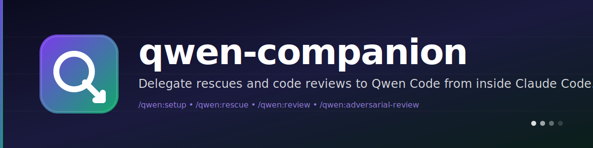

<p align="center">
  <a href="https://github.com/josephyaduvanshi/qwen-companion">
    
  </a>
</p>

<h1 align="center">
  
  &nbsp;qwen-companion
</h1>

<p align="center">
  <strong>Delegate rescues and code reviews to Qwen Code from inside Claude Code.</strong><br/>
  One CLI talking to another. No broker, no protocol dance, no magic.
</p>

<p align="center">
  <a href="https://github.com/josephyaduvanshi/qwen-companion/releases">
    
  </a>
  <a href="https://github.com/josephyaduvanshi/qwen-companion/blob/main/LICENSE">
    
  </a>
  
  
  
  
  
</p>

<p align="center">
  <a href="https://github.com/josephyaduvanshi"></a>
  <a href="https://twitter.com/Josefyaduvanshi"></a>
</p>

<p align="center">
  <em>If this saves you an afternoon, star the repo ⭐</em>
</p>

---

```bash
/qwen:setup
/qwen:rescue investigate why the auth middleware drops cookies on logout
/qwen:review
```

That's the whole thing. You type a slash command, Claude hands the work over to Qwen Code, and you get Qwen's answer back without Claude paraphrasing it.

---

## Table of Contents

- [What you get](#what-you-get)
- [Why this exists](#why-this-exists)
- [Requirements](#requirements)
- [Install](#install)
- [Usage](#usage)
  - [/qwen:setup](#qwensetup)
  - [/qwen:rescue](#qwenrescue)
  - [/qwen:review](#qwenreview)
  - [/qwen:adversarial-review](#qwenadversarial-review)
  - [/qwen:status](#qwenstatus)
  - [/qwen:result](#qwenresult)
  - [/qwen:cancel](#qwencancel)
- [Typical flows](#typical-flows)
- [Feature parity with codex-plugin-cc](#feature-parity-with-codex-plugin-cc)
- [The --effort flag (how it actually works)](#the---effort-flag-how-it-actually-works)
- [Qwen integration](#qwen-integration)
- [State layout](#state-layout)
- [Skills that ship with the plugin](#skills-that-ship-with-the-plugin)
- [Environment variables](#environment-variables)
- [Development](#development)
- [FAQ](#faq)
- [Attribution](#attribution)
- [License](#license)

---

## What you get

- `/qwen:review` — a read-only code review powered by qwen's native `/review` slash command
- `/qwen:adversarial-review` — a steerable review with structured JSON findings
- `/qwen:rescue` — hand any task off to Qwen through a thin subagent
- `/qwen:status`, `/qwen:result`, `/qwen:cancel` — manage background jobs without leaving Claude
- `/qwen:setup` — health check the runtime and toggle the optional stop-time review gate

Everything is Qwen doing the work. This plugin just makes sure the output comes back to you clean, the state is persisted, and cancellation actually cancels.

---

## Why this exists

I wanted codex-plugin-cc's workflow but pointed at Qwen Code.

There's already a qwen plugin floating around built on qwen's `--acp` (Agent Client Protocol) mode. I tried it, it didn't work for me, so I went looking for a different path.

Qwen's `--output-format stream-json` turned out to be almost the same shape as the stream-json protocol Claude Code uses internally: a `system/init`, then `stream_event/content_block_delta` deltas, then a final `result` envelope. That made the port easy. It's also way easier to debug than ACP: every event is a newline of JSON, so I can `tail -f` and pipe through `jq` while things are misbehaving.

The tradeoff is that every task spawns a fresh `qwen` process instead of reusing a persistent one. Cold start is 0.5 to 2 seconds. That's invisible for rescue and review workflows and I am not going to over-engineer a broker to save a second per call.

---

## Requirements

- **Node.js 18.18 or later**
- **Qwen Code CLI 0.14+** installed globally (`npm install -g @qwen-code/qwen-code`)
- **An auth method** configured in `~/.qwen/settings.json`
  - `qwen-oauth` (free, up to 1,000 req/day) — run `qwen auth qwen-oauth`
  - OpenAI-compatible with DashScope — set `DASHSCOPE_API_KEY`
  - `anthropic`, `gemini`, `vertex-ai` — set the corresponding API key
- **Claude Code** (obviously)

`/qwen:setup` walks you through whatever's missing.

---

## Install

Add the marketplace in Claude Code:

```bash
/plugin marketplace add josephyaduvanshi/qwen-companion
```

Install the plugin:

```bash
/plugin install qwen@qwen-companion
```

Reload plugins:

```bash
/reload-plugins
```

Then run:

```bash
/qwen:setup
```

If Qwen Code isn't installed and `npm` is, `/qwen:setup` offers to install it for you. Otherwise, install it yourself:

```bash
npm install -g @qwen-code/qwen-code
qwen auth qwen-oauth    # or configure an API key in ~/.qwen/settings.json
```

After install you should see:

- the `/qwen:*` slash commands listed in your Claude Code session
- the `qwen:qwen-rescue` subagent in `/agents`

A good first run is:

```bash
/qwen:review --background
/qwen:status
/qwen:result
```

---

## Usage

### `/qwen:setup`

Runs a health check. Reports node + npm + qwen versions, auth state, the default model, session runtime, and whether the stop-time review gate is on for this repo.

```bash
/qwen:setup
/qwen:setup --enable-review-gate     # turn on the Stop hook
/qwen:setup --disable-review-gate    # turn it back off
```

> [!NOTE]
> If Qwen isn't installed and `npm` is, setup offers to install it for you. If it's installed but not authenticated, setup tells you exactly which env var or auth command to run.

### `/qwen:rescue`

The "hand something off to Qwen" command. Routes through the `qwen:qwen-rescue` subagent, which calls the companion once and gives you Qwen's answer verbatim — no rewriting, no follow-up.

Use it when you want Qwen to:

- investigate a bug
- try a fix
- take a faster pass with a smaller model
- continue a previous Qwen session

Examples:

```bash
/qwen:rescue investigate why the tests started failing
/qwen:rescue fix the failing test with the smallest safe patch
/qwen:rescue --resume apply the top fix from the last run
/qwen:rescue --model plus --effort high investigate the flaky integration test
/qwen:rescue --model coder fix the issue quickly
/qwen:rescue --background investigate the regression
```

You can also just ask Claude to hand it off in plain English:

```
Ask qwen to redesign the database connection to be more resilient.
```

Claude will pick up the cue and route through the subagent.

**Flags at a glance:**

- `--background` — kick it off, return a job id
- `--wait` — run in the foreground (default)
- `--model <alias>` — `plus`, `max`, `turbo`, `coder`, `glm`, `kimi`, or any model string your qwen install knows
- `--effort <level>` — `none`, `minimal`, `low`, `medium`, `high`, `xhigh` (details [below](#the---effort-flag-how-it-actually-works))
- `--resume` / `--fresh` — continue the latest Qwen session for this repo, or start a new one

> [!NOTE]
> Rescues can take a while depending on the model and the task. If the job looks open-ended, prefer `--background` and check back with `/qwen:status`.

### `/qwen:review`

Runs Qwen's built-in `/review` slash command through the companion. Qwen auto-detects git scope, runs its own `git status` / `diff` / `log`, reads changed files, and writes a Markdown review. The plugin just wraps a header around it and hands you the output.

Use it when you want:

- a review of your current uncommitted changes
- a review of your branch compared to a base branch like `main`

```bash
/qwen:review
/qwen:review --base main
/qwen:review --background
```

> [!NOTE]
> This command is read-only. It does not take custom focus text. Use [`/qwen:adversarial-review`](#qwenadversarial-review) if you want to steer the review toward a specific risk area.

### `/qwen:adversarial-review`

Runs a **steerable** review that challenges the implementation and design, not just the code details.

Same git context as `/qwen:review`, different prompt. This one loads the adversarial review template from `plugins/qwen/prompts/adversarial-review.md`, enforces the schema in `plugins/qwen/schemas/review-output.schema.json` via `--append-system-prompt`, and parses Qwen's reply. Findings come back sorted by severity (critical → high → medium → low) with file:line ranges and concrete fix suggestions.

Use it when you want:

- a pre-ship review that questions the direction, not just the code
- pressure-testing around specific risks like auth, data loss, race conditions, rollback safety
- focus-directed review — anything you type after the flags is forwarded as focus instructions

```bash
/qwen:adversarial-review
/qwen:adversarial-review --base main challenge the caching and retry design
/qwen:adversarial-review --background look for race conditions around cache invalidation
```

> [!WARNING]
> After an adversarial review, Claude will present findings and stop. It will **not** auto-fix anything. You have to pick which findings to act on and explicitly ask Claude to fix them. That's intentional.

### `/qwen:status`

Shows running and recent Qwen jobs for this repository, scoped to the current Claude Code session.

```bash
/qwen:status                           # compact table of current + recent jobs
/qwen:status task-abc123               # full record for one job
/qwen:status task-abc123 --wait        # block until the job finishes
/qwen:status --all                     # include jobs from other sessions
```

Use it to check background progress, see the latest completed job, or confirm whether a task is still running.

### `/qwen:result`

Shows the stored final output for a finished job. Ends with a `qwen --chat-recording --resume <session_id>` footer you can paste into a terminal to keep the conversation going outside of Claude Code.

```bash
/qwen:result                    # latest finished job in this session
/qwen:result task-abc123        # a specific job
```

### `/qwen:cancel`

Cancels an active Qwen job. Gracefully. It sends `SIGINT` first and waits 2 seconds — qwen's own handler exits cleanly on SIGINT, so in practice this is the only signal that ever actually fires. If qwen is still alive, it gets `SIGTERM`, another 2 seconds, then `SIGKILL`.

```bash
/qwen:cancel                    # cancel the only active job in this session
/qwen:cancel task-abc123        # cancel a specific job
```

Signals target the whole process group because workers are spawned with `detached: true`, so `kill(-pid)` reaches every child. The job log records exactly which signal fired and whether the process exited gracefully.

---

## Typical flows

### Review before shipping

```bash
/qwen:review
```

### Hand a problem to Qwen

```bash
/qwen:rescue investigate why the build is failing in CI
```

### Start something long-running

```bash
/qwen:adversarial-review --background
/qwen:rescue --background investigate the flaky test
```

Then check in with:

```bash
/qwen:status
/qwen:result
```

### Continue a Qwen session you started in a terminal

```bash
# Outside Claude Code:
qwen --chat-recording -p "Plan the cache invalidation refactor"

# Later, inside Claude Code:
/qwen:rescue --resume apply the plan you just made
```

The plugin scans `~/.qwen/projects/<cwd>/chats/*.jsonl` and finds the most recent session for this repo, whether or not it was started through the plugin.

---

## Feature parity with codex-plugin-cc

Everything from [openai/codex-plugin-cc](https://github.com/openai/codex-plugin-cc) v1.0.3 is here. This table is the full map.

| Feature | codex-plugin-cc | qwen-companion |
|---|---|---|
| `/setup` with review-gate toggle | ✅ | ✅ |
| `/rescue` with `--model`, `--effort`, `--resume`, `--fresh`, `--write`, `--background`, `--wait` | ✅ | ✅ |
| `/review` | ✅ via `review/start` JSON-RPC | ✅ via qwen's built-in `/review` slash command |
| `/adversarial-review` | ✅ with JSON schema | ✅ same schema, enforced via `--append-system-prompt` |
| `/status`, `/result`, `/cancel` | ✅ | ✅ |
| `--effort none..xhigh` | GPT-5.4 reasoning budget | tool-call budget via `--max-session-turns` plus a system-prompt directive |
| Model aliases | ✅ | ✅ — `plus`, `max`, `turbo`, `coder`, `glm`, `kimi` (anything else passes through) |
| `--background` worker | ✅ | ✅ detached subprocess, same job lifecycle |
| `--resume-last` / `--fresh` | ✅ | ✅ via `qwen --chat-recording --resume` |
| Resume picks up out-of-plugin sessions | ✅ (shared thread store) | ✅ scans `~/.qwen/projects/<cwd>/chats/*.jsonl` |
| Graceful cancel | ✅ `turn/interrupt` RPC | ✅ two-phase `SIGINT`, `SIGTERM`, `SIGKILL` with 2-second grace periods |
| Stop-time review gate | ✅ | ✅ |
| SessionStart / SessionEnd hook | ✅ | ✅ |
| Touched-files tracking | ✅ from protocol | ✅ from qwen `tool_use` events (`write_file`, `edit`, `replace`, `create_file`) |
| `scripts/bump-version.mjs` | ✅ | ✅ |
| CI workflow | ✅ | ✅ shipped as `.yml.template` (rename after cloning) |
| Shared app-server broker | ✅ | ❌ intentional. Qwen has no persistent server mode. Per-task spawn is fine for rescue/review workflows. I'll adopt if upstream qwen adds one. |

---

## The --effort flag (how it actually works)

Qwen has no native reasoning-budget dial like GPT-5.4 does, so I built the next-best thing: `--effort` caps the actual tool-call budget via qwen's `--max-session-turns` and adds a reasoning-depth hint to the system prompt.

| Level | `--max-session-turns` | System prompt hint |
|---|---|---|
| `none` | 1 | "Do not use reasoning. Reply directly without deliberation." |
| `minimal` | 2 | "Use minimal reasoning. Be terse and decisive." |
| `low` | 4 | "Think briefly before answering." |
| `medium` | *(unbounded, default)* | *(none)* |
| `high` | *(unbounded)* | "Think carefully and consider multiple angles before answering." |
| `xhigh` | *(unbounded)* | "Think very carefully. Consider edge cases, alternative approaches, and potential pitfalls." |

`none` through `low` are real hard caps. Qwen cannot sneak extra tool rounds past them. `high` and `xhigh` are hints — there's no way to force qwen to think more if it doesn't want to.

---

## Qwen integration

The plugin uses the global `qwen` binary installed in your environment and picks up the same `~/.qwen/settings.json` configuration you'd get from running `qwen` directly.

### Common configurations

If you want to change the default model, edit `~/.qwen/settings.json`:

```json
{
  "security": { "auth": { "selectedType": "openai" } },
  "model": { "name": "qwen3.5-plus" },
  "env": { "DASHSCOPE_API_KEY": "sk-..." }
}
```

The plugin reads `model.name` and surfaces it in `/qwen:setup`. Per-task `--model` overrides always win.

### Moving the work over to Qwen

Every `/qwen:result` output ends with a footer like:

```
Qwen session ID: 8a205db3-affe-4e9f-b7d5-a5ade53473e6
Resume in Qwen: qwen --chat-recording --resume 8a205db3-affe-4e9f-b7d5-a5ade53473e6
```

Paste that into a terminal to keep working in Qwen directly, with full chat history intact.

---

## State layout

The companion writes state under `$CLAUDE_PLUGIN_DATA/state/<slug>-<hash>/` when running inside Claude Code, or under `$TMPDIR/qwen-companion/<slug>-<hash>/` otherwise:

```
state.json         config + jobs index
jobs/
  task-<id>.json   full job record: request, payload, rendered output
  task-<id>.log    timestamped progress log
```

Jobs are scoped to a Claude session via `QWEN_COMPANION_SESSION_ID`, which the SessionStart hook exports. When a session ends, any queued or running jobs for that session are torn down. The state file is capped at 50 jobs per workspace — older ones are pruned automatically.

---

## Skills that ship with the plugin

All three are marked `user-invocable: false` because they exist to guide Claude, not to be slash commands you type:

- **`qwen-cli-runtime`** — the one-Bash-call contract the rescue subagent follows. Exists so Claude doesn't drift into reading files or drafting plans when the whole point is to delegate.
- **`qwen-result-handling`** — how to present Qwen's output. The important rule: after a review, *stop*. Don't auto-fix findings. Ask.
- **`qwen-prompting`** — a short guide to writing good Qwen prompts using XML block tags like `<task>`, `<structured_output_contract>`, `<verification_loop>`, `<grounding_rules>`, and `<action_safety>`.

---

## Environment variables

| Variable | What it does |
|---|---|
| `CLAUDE_PLUGIN_DATA` | Parent directory for plugin state. Claude Code sets this automatically. |
| `QWEN_COMPANION_SESSION_ID` | Exported by the SessionStart hook so jobs can be scoped per Claude session. |
| `QWEN_BIN` | Override the qwen binary path. Used by the test fixture to point at a fake qwen. |

---

## Development

```bash
git clone https://github.com/josephyaduvanshi/qwen-companion.git
cd qwen-companion
node --test tests/*.test.mjs
```

**107 tests**, most of them against either the library modules directly or the runtime via a fake qwen fixture (`tests/fake-qwen-fixture.mjs`). The fake qwen is a tiny Node script that prints a canned stream-json transcript, which lets `runQwenTurn()` run in CI without the real CLI installed.

### Useful dev commands

```bash
# bump all three manifests to a new version
node scripts/bump-version.mjs 1.1.1

# verify all three manifests agree with package.json
node scripts/bump-version.mjs --check

# run just one test file
node --test tests/runtime.test.mjs
```

### CI

The CI workflow ships as `.github/workflows/pull-request-ci.yml.template`. Rename it to `.yml` after cloning:

```bash
mv .github/workflows/pull-request-ci.yml.template \
   .github/workflows/pull-request-ci.yml
```

It runs the test suite on Node 18, 20, and 22 across Ubuntu and macOS, syntax-checks every `.mjs` file, and validates the JSON manifests.

### Repo layout

```
qwen-companion/
├── .claude-plugin/
│   └── marketplace.json       ← Claude Code marketplace entry
├── plugins/
│   └── qwen/
│       ├── .claude-plugin/plugin.json
│       ├── agents/qwen-rescue.md
│       ├── commands/          ← slash command definitions
│       ├── hooks/hooks.json   ← SessionStart/End + Stop gate
│       ├── prompts/           ← adversarial-review + stop-review-gate templates
│       ├── schemas/           ← review-output.schema.json
│       ├── scripts/
│       │   ├── qwen-companion.mjs        ← subcommand router
│       │   ├── session-lifecycle-hook.mjs
│       │   ├── stop-review-gate-hook.mjs
│       │   └── lib/                      ← state, render, git, qwen adapter…
│       └── skills/            ← qwen-cli-runtime, qwen-result-handling, qwen-prompting
├── scripts/bump-version.mjs
├── tests/                     ← 107 tests across 13 files
└── .github/workflows/
```

---

## FAQ

### Do I need a separate Qwen account for this plugin?

No. If you're already signed into Qwen Code on this machine, the plugin picks up your existing auth automatically. The plugin uses your local Qwen CLI authentication, not its own.

### Does the plugin use a separate Qwen runtime?

No. It delegates through your local [Qwen Code CLI](https://github.com/QwenLM/qwen-code) on the same machine. That means:

- same qwen install you'd use directly
- same local auth state
- same `~/.qwen/settings.json` config
- same repository checkout and environment

### Will it use the same Qwen config I already have?

Yes. The plugin reads `~/.qwen/settings.json` for the default model, auth type, and environment variables. Per-task `--model` overrides always win.

### Can I still use `qwen --resume` directly in my terminal?

Yes. The plugin passes `--chat-recording` on every run, so every session is persisted. Copy the session ID out of `/qwen:result` and paste it into `qwen --chat-recording --resume <id>` whenever you want.

### Why not ACP mode like the other qwen plugin?

I tried it, I couldn't get it working reliably against my qwen install, and the stream-json path turned out to be easier to port and easier to debug. See [Why this exists](#why-this-exists).

### Why is there no shared broker like codex has?

Qwen doesn't ship a persistent `app-server` subcommand. Stream-json input mode exists but the process exits after a single completed turn, so a real broker would need either a new qwen mode or a fragile ACP implementation. Neither seemed worth it for the 0.5–2s cold start cost I'd save per task. If upstream qwen adds a persistent server mode, I'll adopt it.

### Can I use this with other qwen-compatible CLIs?

Anything that speaks qwen's `--output-format stream-json` protocol and respects `--max-session-turns`, `--chat-recording`, `--yolo`, `--approval-mode`, and `--append-system-prompt` should work. Point the `QWEN_BIN` env var at it.

---

## Attribution

This plugin is derived from [openai/codex-plugin-cc](https://github.com/openai/codex-plugin-cc), Copyright 2025 OpenAI, Apache-2.0. A lot of the state model, job tracking, rendering, command layout, skill design, and test harness are direct ports.

The CLI adapter in `plugins/qwen/scripts/lib/qwen.mjs` is mine. See `NOTICE` and `LICENSE` for the full terms.

---

## License

Apache-2.0. See [LICENSE](./LICENSE).

---

<p align="center">
  Built by <a href="https://github.com/josephyaduvanshi">Joseph Yaduvanshi</a><br/>
  <sub>If this saved you an afternoon, a ⭐ on the repo is the nicest thank-you.</sub>
</p>
